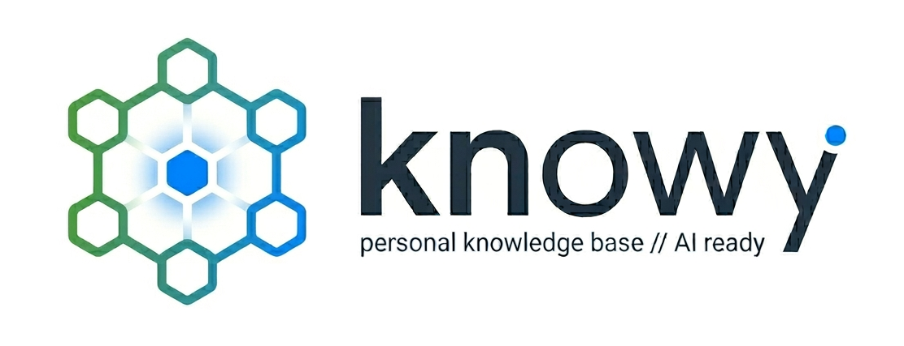

# Knowy

<p align="center">
  
</p>

Persistent storage backend for AI-powered personal assistants. Provides a structured, searchable data layer for pages, tasks, chats, files, calendars, and knowledge bases.

```ts
import knowy from 'knowy';

const channel = knowy.channel('./my-life');

const page = channel.savePage({ title: 'Meeting Notes', content: '# Q3 Planning' });
const task = channel.saveTask({ title: 'Research vector search' });

const results = channel.search('vector search');
console.log(results[0].entity.title); // 'Meeting Notes'
```

## Features

- **Nine entity types** — User, Page, Task, File, Article, Event, Chat, Message, KnowledgeBase
- **RAG search** — cross-entity hybrid vector + FTS search via anigodb (no external vector DB needed)
- **Encrypted at rest** — automatic OS keychain encryption (256-bit AES), with file-based fallback
- **Synchronous API** — simple, predictable control flow, no async/await
- **Dual ESM/CJS** — works with both `import` and `require`
- **Full TypeScript types** — strict interfaces for every entity

## Installation

```sh
npm install knowy
```

Requires Node.js 22+.

## Quick Start

```ts
import knowy from 'knowy';

const channel = knowy.channel('/path/to/channel');

// Create entities
const page = channel.savePage({ title: 'Shopping List', content: 'Milk, eggs, bread' });
const task = channel.saveTask({ title: 'Deploy API', status: 'in_progress' });
const user = channel.saveUser({ name: 'Alice' });

// Read
channel.getPage(page.id);            // => Page
channel.listTasks({ status: 'in_progress' }); // => Task[]

// Update
channel.updateTask(task.id, { status: 'done', detail: 'Deployed to prod' });

// Chat
const chat = channel.chat({ title: 'Dev Discussion' });
chat.saveMessage({ userId: user.id, content: 'Hello world' });

// Semantic search
channel.search('deployment');      // => SearchResult[]

// Link records together
const readme = channel.savePage({ title: 'Setup Docs', content: '# Getting started', links: task.id });

// Clean up
channel.close();
```

## Core Concepts

### Channel

A Channel is a workspace backed by a single encrypted SQLite database at a directory path. Open one per domain (e.g. "Work", "Personal").

### Entities

| Entity | Description | Key Fields |
|--------|-------------|------------|
| **User** | A person or agent identity | `name`, `metadata` |
| **Page** | Durable document (md/html/text/json/xml) | `title`, `content`, `type` |
| **Task** | Action item with status | `title`, `status`, `due`, `detail` |
| **File** | Copied into `<channel>/files/` | `filename`, `path`, `size` |
| **Article** | Q&A wiki document in a KB | `title`, `content`, `answer` |
| **Event** | Calendar event | `title`, `start`, `end`, `rrule` |
| **Message** | Chat message | `userId`, `content`, `reply`, `mention` |

Every entity carries auto-managed `createdAt` and `updatedAt` timestamps, an optional `sourceMessageId` for traceability back to the Chat message that created it, and an optional `links` field to reference other records.

### Relationships Between Records

Any entity can link to any other entity via the `links` field. Accepts a single record ID or array of IDs.

```ts
const task = channel.saveTask({ title: 'Write docs' });
const page = channel.savePage({ title: 'Documentation', content: '# Docs', links: task.id });
const updatedTask = channel.updateTask(task.id, { links: [page.id] });
```

Linked IDs are validated for existence at write time.

### Identifiable IDs

Every record gets a type-prefixed ID (e.g. `page-6a35f027dc53aed0f028cc6f`, `task-a1b2c3...`, `message-d4e5f6...`). The timestamp-based format preserves insertion order for pagination.

### KnowledgeBase

Named collections of Q&A articles, each backed by its own anigodb collection with RAG search.

```ts
const kb = channel.knowledge('Company Wiki');
kb.saveArticle({ title: 'Remote Policy', content: 'WFH up to 3 days/week.', answer: '3 days' });
kb.search('remote work'); // searches only this KB
```

### Schedule

Named calendars with date-range queries.

```ts
const sched = channel.schedule('Work');
sched.saveEvent({ title: 'Standup', start: '2026-06-19T09:00:00Z' });
sched.queryEvents({ startAfter: '2026-06-19T00:00:00Z', endBefore: '2026-06-19T23:59:59Z' });
```

### Chat & Messages

Conversation sessions with threaded replies and @-mention support.

```ts
const chat = channel.chat({ title: 'Sprint Planning' });
const msg = chat.saveMessage({ userId: 'alice-id', content: 'Should we migrate?' });
chat.saveMessage({ userId: 'bob-id', content: 'Yes', reply: msg.id });
chat.saveMessage({ userId: 'alice-id', content: '@bob lets discuss', mention: ['bob-id'] });
chat.getReplies(msg.id); // => [Message]
channel.listChats();      // => ChatSummary[]
```

## Search

`channel.search(query)` performs cross-entity hybrid vector + FTS search across all RAG-indexed collections. Returns results ranked by relevance.

```ts
const results = channel.search('database migration', { limit: 10, collection: 'tasks' });
// results: [{ collection, entityType, id, title, snippet, score, entity }]
```

RAG indexes are created lazily on first search call — no setup required.

## Encryption

Knowy automatically encrypts the database at rest using 256-bit AES (SQLCipher4). On first use, a random key is generated and stored in the OS keychain. If the keychain is unavailable, the key falls back to `<channel-dir>/knowy.key`.

The key is per-channel — each directory path gets its own unique key.

## API

See the [full API reference](docs/design.md) for detailed signatures of every method.

## License

MIT
